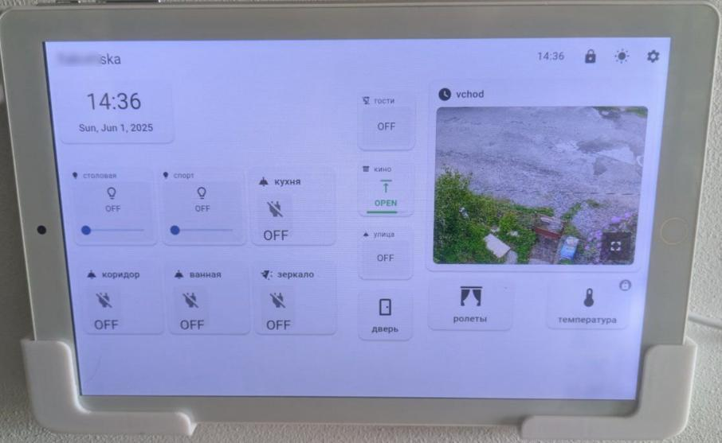

# Home Assistant Flutter Dashboard

A Flutter-based dashboard application for Home Assistant that can also function as an Android launcher.

> **Perfect for Old Tablets!** This project was specifically created to give new life to very old Android tablets (like Android 7) that are too slow to run the standard Home Assistant web interface. The native Flutter app provides smooth performance even on older hardware.


*The dashboard running on a real tablet, showing the clean interface with various Home Assistant controls*

<p><span style="color: red; font-size: 2em;"><b>Please note that's just a "pet project" and test of vibe-coding possibilities</b></span></p>

## Features

- **Home Assistant Integration**:
  - Automatically discovers Home Assistant instances on your local network
  - Manual server URL entry with validation
  - Secure authentication via long-term access token
  - Real-time updates for all entities via WebSocket API
  - Automatic reconnection on connection loss

- **Dashboard Widgets**:
  - **Time**: Display current time and date with configurable format
  - **Light**: Control lights (on/off, brightness, color if supported)
  - **Switch**: Control switches and input_boolean entities (on/off)
  - **Blind/Cover**: Control blinds/covers (open, close, stop, position control)
  - **Lock**: Control smart locks (lock/unlock/open)
  - **Climate**: Control climate devices (on/off, temperature, mode)
  - **Static**: Display state of any entity (sensors, etc.)
  - **Label**: Static text display with customizable formatting
  - **Separator**: Visual separator lines for organizing layout
  - **RTSP Video**: Display live video streams from cameras
  - **Group**: Organize widgets into collapsible groups with popup interface

- **Advanced Layout & Editing**:
  - **Free positioning**: Drag widgets anywhere on the dashboard
  - **Flexible sizing**: Resize widgets to any size, not just grid-based
  - **Edit mode**: Edit icon at title bar to enter edit mode, drag to reposition
  - **Visual feedback**: Clear editing indicators and handles

- **Security & Lock Features**:
  - **Dashboard lock**: PIN protection to prevent unauthorized changes
  - **Launcher mode**: Can function as Android launcher (kiosk mode)
  - **Protected widgets**: Individual widgets can be marked as protected to avoid unauthorized usage (for example prevent guests from changing climate settings)
  - **Settings PIN**: Secure access to configuration settings

- **Device Integration**:
  - **Android launcher capability**: Replace your home screen
  - **Kiosk mode**: Prevents users from accessing other apps
  - **Auto-start**: Launches on device boot when set as launcher
  - **Material design**: Beautiful interface with light and dark mode support
  - **Full MDI icon support**: Use any Material Design Icon (mdi:ceiling-light, etc.)
  - **Responsive design**: Adapts to different screen sizes and orientations

## Getting Started

1. **Install the app** on your Android device (build from source or use a pre-built APK)

2. **Connect to Home Assistant**:
   - Run the app and it will automatically scan for Home Assistant instances on your network
   - Or manually enter your Home Assistant URL
   - Ensure your Home Assistant is accessible on your local network

3. **Set up authentication**:
   - Generate a long-term access token in Home Assistant:
     - Go to your profile in Home Assistant (click your name in the sidebar)
     - Scroll down to "Long-Lived Access Tokens"
     - Click "Create Token", give it a name, and copy the token
   - Paste the token into the app

4. **Configure launcher mode** (optional):
   - Enable launcher mode if you want the app to function as your device's home screen
   - This is perfect for dedicated tablet dashboards
   - The app will start automatically and prevent access to other apps

5. **Set up dashboard security** (optional):
   - Set a PIN to lock dashboard editing
   - Configure protected widgets for sensitive controls
   - This prevents unauthorized changes to your dashboard

6. **Start building your dashboard**:
   - Tap the "+" button to add widgets
   - Long-press any widget to enter edit mode
   - Drag widgets to reposition them
   - Resize widgets by dragging the corners in edit mode
   - Use groups to organize related controls

## Perfect for Old Tablets

This project was specifically designed to breathe new life into older Android tablets that struggle with modern web interfaces:

### Why This App Exists
- **Old tablet revival**: Turn that dusty Android 7+ tablet into a useful smart home control panel
- **Performance optimized**: Native Flutter app runs smoothly on hardware too slow for web browsers
- **Resource efficient**: Much lighter than running Home Assistant's web interface in a browser
- **Always-on dashboard**: Perfect for wall-mounted tablets that stay powered on

### Ideal Use Cases
- **Wall-mounted control panels**: Mount an old tablet near your front door or bedside
- **Kitchen dashboard**: Control lights, music, and check weather while cooking
- **Bedside controller**: Easy access to bedroom lights, climate, and alarm controls
- **Guest room interface**: Simple controls for visitors without needing the main app

### Hardware Recommendations
- **Minimum**: Android 7.0+ with 2GB RAM
- **Optimal**: Any tablet with 8"+ screen for comfortable touch targets
- **Mounting**: Consider tablet wall mounts for permanent installation
- **Power**: Keep plugged in for always-on operation

## Customization

### Widget Configuration
Each widget can be extensively customized with:
- **Caption text**: Custom labels for easy identification
- **Icons**: Full Material Design Icons support in "mdi:" format (e.g., mdi:lightbulb, mdi:thermometer)
- **Size and position**: Free-form positioning and sizing anywhere on the dashboard
- **Widget-specific settings**: Each widget type has unique configuration options
- **Protection level**: Mark widgets as protected to prevent accidental changes
- **Simplified view**: Toggle detailed vs. simplified display modes

### Layout Features
- **Free positioning**: Place widgets anywhere with pixel-perfect precision
- **Dynamic resizing**: Resize widgets to any dimensions, not limited to grid cells
- **Visual guides**: Alignment helpers and snap-to-grid options during editing
- **Group organization**: Create popup groups to organize related controls

### Advanced Options
- **Dashboard themes**: Light and dark mode support with automatic switching
- **Icon customization**: Choose from thousands of Material Design Icons
- **Entity filtering**: Show only relevant entities for each widget type
- **Real-time updates**: Instant visual feedback when entity states change
- **Offline indicators**: Clear visual cues when connectivity is lost

## Development

### Prerequisites

- Flutter SDK
- Android Studio / VS Code
- Android device or emulator

### Building

```bash
# Get dependencies
flutter pub get

# Run the app in debug mode
flutter run

# Build the release APK
flutter build apk
```

## License

This project is licensed under the MIT License.
